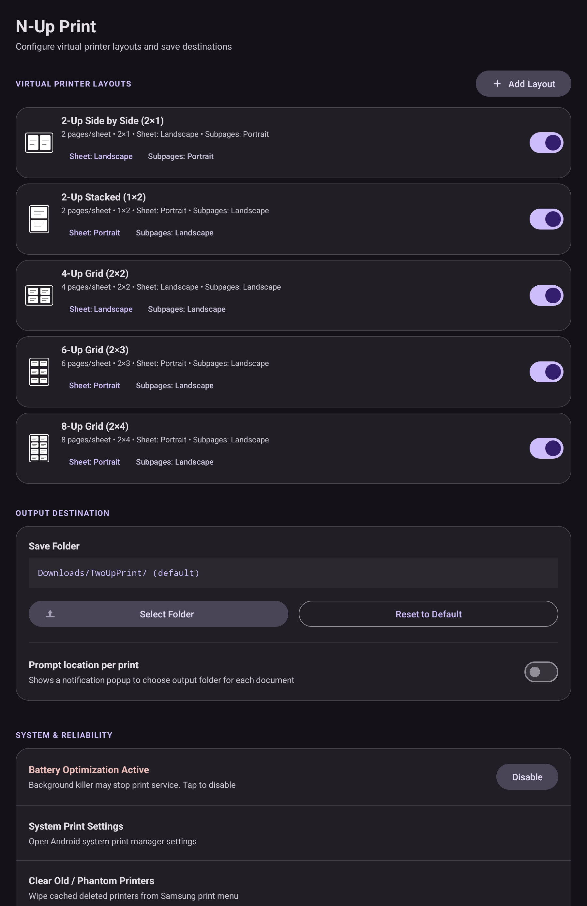
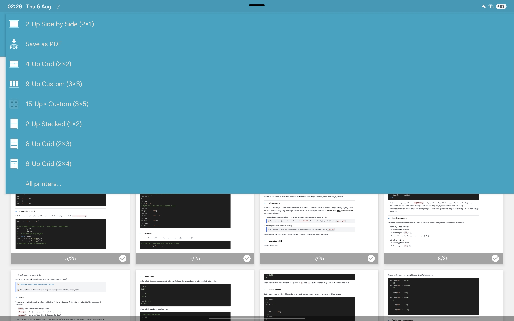

# N-Up Print for Android (Virtual Printer Service)

[](https://github.com/kolardavidcz/N-up-virtual-printer/releases/tag/v1.3.0)
[](https://android-arsenal.com/api?level=26)
[](LICENSE)
[](https://developer.android.com/about/versions/oreo)

**N-Up Print** is an advanced open-source Android Virtual Printer Service plugin designed to combine multiple pages into a single sheet (2-up, 4-up, 6-up, 8-up, or custom N-up grids) directly from any Android app's native system print dialog (Chrome, Samsung Notes, Gallery, Word, PDF viewers, and more).

Unlike standard print services that rasterize documents into low-resolution images, **N-Up Print** performs pure vector-level PDF merging using Apache PDFBox. Text remains **100% selectable**, fonts remain razor-sharp, and vector graphics preserve full scaling resolution.

---

## 📥 Download APK

- **Latest Release (v1.3.0)**: [Download N-Up Print v1.3.0 APK](https://github.com/kolardavidcz/N-up-virtual-printer/releases/download/v1.3.0/nup-print-v1.3.0.apk)
- **Local Mirror**: [`releases/nup-print-v1.3.0.apk`](releases/nup-print-v1.3.0.apk)

---

## 🖼️ Screenshots & Interface

| Material 3 Settings & Virtual Printers | System Print Spooler Integration |
|:---:|:---:|
|  |  |

---

## ✨ Features & Capabilities

- 📄 **True Vector PDF N-Up Merging**: Combines 2, 4, 6, 8, or arbitrary N-up pages onto a single sheet without rasterizing to bitmaps. Text is 100% selectable and vector paths remain sharp.
- 📐 **Adaptive "Best Fit" for Presentations (16:9 & 4:3)**: Automatically sizes the output PDF sheet to match the exact combined aspect ratio of presentation slides in 4-up (2×2) or N-up grids, completely eliminating empty white/black letterboxing bars.
- 📏 **Visual Page & Slot Margins (Per Side: Top, Bottom, Left, Right)**: Interactive per-side margin spacing arranged around a live visual box-model preview card in the app. Protects slide headers, footers, binding edges, and page numbers from clipping.
- 📑 **Unified "Match Document Size" Paper Size**: Registers a unified `Match Document Size (Auto N-Up)` media size directly in the Samsung / Android Print Spooler dialog, dynamically calculating the exact destination sheet size to eliminate letterboxing.
- 🔗 **Clickable Hyperlinks & Auto-URL Detection**: Preserves existing PDF hyperlinks and auto-detects plain text URLs with exact transformed bounding boxes and balanced punctuation trimming.
- 🖋️ **High-Contrast Vector Text & Formula Booster**: Enhances faint gray text, math formulas, and notes to solid black while preserving 100% text selectability and color images.
- 🎛️ **Dual Orientation Control (Sheet vs. Subpages)**:
  - **Sheet Orientation**: Configure output sheet layout (`Landscape` vs. `Portrait`).
  - **Subpages Orientation**: Configure source document page fitting (`Landscape` vs. `Portrait`) with automatic 90° vector rotation for optimal layout density.
- 🎨 **Realistic Showcase Preview Icons**: Virtual printers display white-on-transparent grid diagram icons featuring exact subpage aspect ratios.
- 🧹 **1-Tap Phantom Printer Cleanup**: Built-in troubleshooting utility to clear cached deleted printers from Samsung Print Spooler (`com.samsung.android.printspooler`) app memory.
- 🧩 **Custom X:Y Grid Layout Creator**: Create custom grid layouts (e.g., 3×3, 4×4, 3×5) with automatic orientation suggestions.
- 📁 **Flexible Save Destinations**: Automatically save PDFs to `Downloads/TwoUpPrint/`, pick a custom Storage Access Framework (SAF) folder tree, or enable high-priority notification popups per print job.
- 🏷️ **Smart Document Naming**: Automatically extracts web page titles or document labels to produce clean file names (e.g., `Article Title_2x1.pdf`).
- ⚡ **Samsung One UI Battery Reliability**: Battery optimization exemption helper ensures the background print discovery service stays alive and active.

---

## 🔍 SEO Search Keywords & Target Use Cases

- *Print 2 pages on 1 sheet Android*
- *Android N-Up PDF Virtual Printer*
- *Samsung Galaxy Print Service Extension 2-Up 4-Up*
- *Combine multiple PDF pages into one page Android*
- *Vector PDF N-up printer plugin for Android tablet*
- *Save N-up PDF from Samsung Notes / Chrome / Gallery*

---

## 🛠️ Tech Stack & Architecture

- **Language**: Kotlin 2.0
- **UI System**: Native Material Design 3 (Dark Theme)
- **PDF Core**: Apache PDFBox Android (`com.tom-roush:pdfbox-android:2.0.27.0`)
- **Android Subsystems**: `PrintService`, `PrinterDiscoverySession`, Storage Access Framework (`ACTION_CREATE_DOCUMENT`, `ACTION_OPEN_DOCUMENT_TREE`)
- **Compatibility**: Android 8.0+ (API Level 26+, optimized for Samsung One UI)

---

## 🚀 Build & Installation (Windows 1-Click USB ADB)

To automatically compile, install over USB ADB, and launch on your connected Android device:

- **Double-click `update_app.bat`** from Windows File Explorer, OR
- **Run `update_app.ps1` in PowerShell**:
  ```powershell
  .\update_app.ps1
  ```

*The scripts automatically close after 3 seconds upon successful update.*
