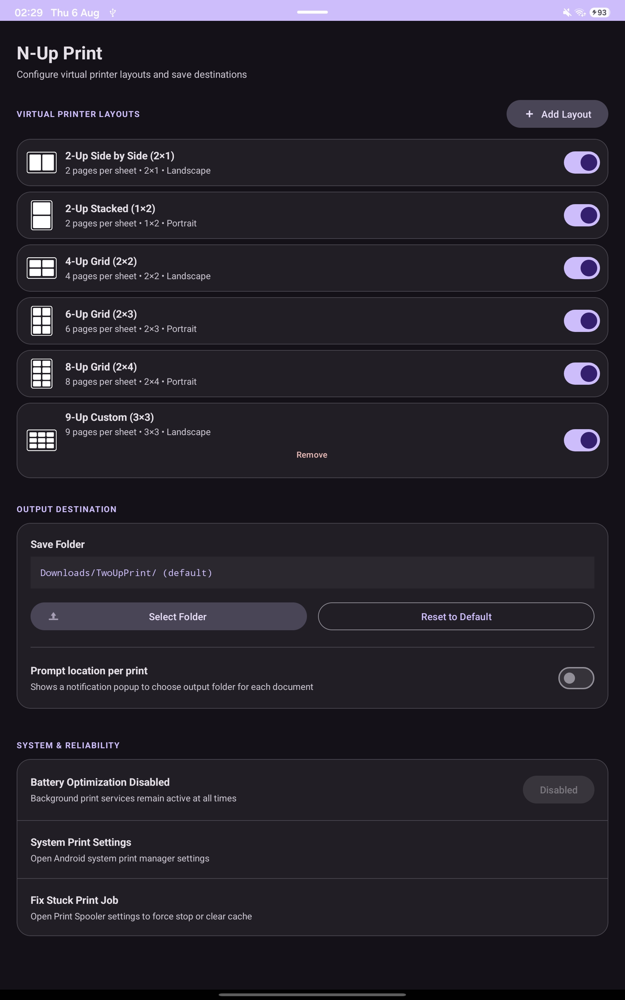

# N-Up Print for Android (Virtual N-Up PDF Printer & Page Merger)

[](https://github.com/kolardavidcz/N-up-virtual-printer/releases/tag/v1.0.0)
[](https://android-arsenal.com/api?level=26)
[](LICENSE)

**N-Up Print** is a native Android Print Service plugin and virtual PDF printer that enables you to convert web pages, documents, and photos into vector-accurate N-up grid layouts (2×1, 1×2, 2×2, 2×3, 2×4, and custom X×Y configurations) directly from any app's system print dialog on Android & Samsung One UI.

---

## 📥 Download

- **Latest Release (v1.0.0)**: [Download N-Up Print v1.0.0 APK](https://github.com/kolardavidcz/N-up-virtual-printer/releases/download/v1.0.0/nup-print-v1.0.0.apk)
- **Local Mirror**: [releases/nup-print-v1.0.0.apk](releases/nup-print-v1.0.0.apk)

---

## 🖼️ Screenshots

| Application Settings | System Print Spooler Integration |
|:---:|:---:|
|  |  |

---

## ✨ Features & Capabilities

- 📄 **True Vector PDF Output**: Merges pages into multi-up layouts while preserving 100% selectable text, crisp fonts, and resolution-independent vector shapes (no bitmap rasterization).
- 📐 **Independent Dual-Axis Orientation Controls**:
  - **Sheet Orientation**: Configures the final output A4 sheet layout (`Landscape` vs `Portrait`).
  - **Subpages Orientation**: Defines default source document orientation (`Landscape` vs `Portrait`) communicated to Samsung Print Spooler.
- 🧩 **Custom X:Y Grid Layout Creator**: Add your own grid configurations (e.g. 3×3, 4×4, 1×3, 3×5) on the fly with smart automatic orientation inference.
- 🎨 **Monocolor Vector Preview Icons**: Displays clean white-on-transparent preview icons with realistic subpage aspect ratios inside Android's system print dialog.
- 🎛️ **Per-Layout Enable / Disable Switches**: Enable or disable specific printer layouts in app settings so disabled printers don't clutter your system print menu.
- 🧹 **1-Tap Phantom Printer Cleanup**: Built-in tool to clear cached deleted printers from Samsung Print Spooler memory.
- 🏷️ **Automatic Title Extraction**: Automatically names output files based on web page titles or document labels (e.g., `Article Title_2x1.pdf`).
- 🔔 **Instant Save Location Prompt**: Save directly to a preselected folder or enable high-priority notification popups to choose a destination per print job.
- ⚡ **Samsung One UI Reliability**: Built-in battery optimization exemption helper ensures background print services stay alive and discoverable at all times.

---

## ❓ Frequently Asked Questions (FAQ)

### How do I print 2 pages on 1 sheet on Android?
1. Open any document, web page (Chrome, Samsung Internet), or PDF in your favorite Android app.
2. Tap **Share -> Print** (or **Menu -> Print**).
3. Select **2-Up Side by Side (2×1)** from the printer dropdown menu.
4. Tap **Print** — your 2-up vector PDF will be saved to your Downloads folder!

### Why does text stay selectable in output PDFs?
Unlike simple screenshot-based print apps that convert documents into images, **N-Up Print** uses an Apache PDFBox vector merger pipeline (`LayerUtility`). It transforms document streams natively, ensuring text remains selectable, searchable, and crystal-clear at any zoom level.

### How do I remove deleted custom printers from Samsung's print menu?
Samsung Print Spooler caches previously created virtual printers in app storage. To wipe old phantom printers:
1. Open **N-Up Print** app.
2. Scroll to **System & Reliability** and tap **Clear Old / Phantom Printers**.
3. Tap **Open Storage Settings** -> **Storage** -> **Clear Data**.

---

## 🛠️ Tech Stack & Architecture

- **Language**: Kotlin 2.0
- **UI Framework**: Native Material Design 3 (Dark Theme)
- **PDF Engine**: Apache PDFBox Android (`com.tom-roush:pdfbox-android:2.0.27.0`)
- **Android Framework**: `PrintService`, `PrinterDiscoverySession`, Storage Access Framework (`ACTION_CREATE_DOCUMENT`, `ACTION_OPEN_DOCUMENT_TREE`)
- **Compatibility**: Android 8.0+ (API Level 26+)

---

## 🚀 Build & Installation

### 1-Click USB Debug Update (Windows)

To automatically compile, install over USB ADB, and launch on your connected Android device:

- **Double-click `update_app.bat`** from Windows File Explorer, OR
- **Run `update_app.ps1` in PowerShell**:
  ```powershell
  .\update_app.ps1
  ```

*The scripts auto-close after 3 seconds upon successful update.*

---

## 🆓 License

This software is 100% free and unencumbered public domain software released under the **CC0 1.0 Universal (CC0 1.0) Public Domain Dedication**. Free for any purpose, commercial or personal, with zero restrictions and no attribution required. See [LICENSE](LICENSE) for details.
