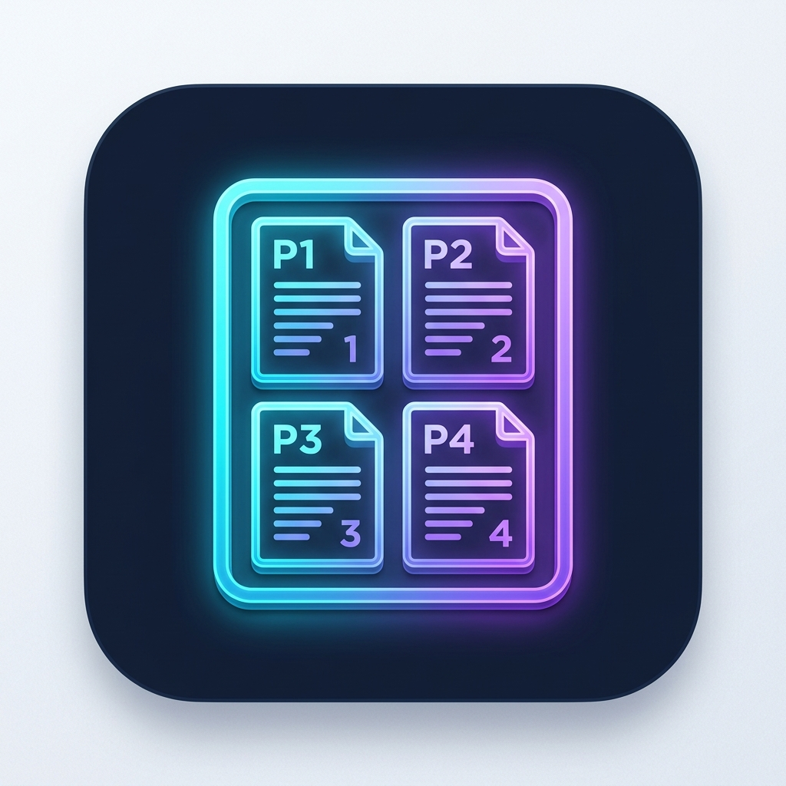

# N-Up Print for Android



**N-Up Print** is an Android Print Service plugin that converts web pages, documents, and photos into vector-accurate N-up grid layouts (2×1, 1×2, 2×2, 2×3, 2×4, and custom X×Y configurations) directly from any app's print dialog.

---

## Features

- **True Vector PDF Output**: Merges pages into multi-up layouts while preserving 100% selectable text, crisp fonts, and resolution-independent vector shapes (no bitmap rasterization).
- **Custom X:Y Grid Creator**: Add your own grid configurations (e.g. 3×3, 4×4, 1×3) on the fly.
- **Dynamic System Print Icons**: Automatically generates white-on-transparent preview icons for both standard and custom X:Y layouts inside Android's system print dialog.
- **Independent Layout Toggles**: Enable or disable specific printer layouts in app settings to keep your print menu clutter-free.
- **Automatic Title Extraction**: Automatically names output files based on web page titles or document labels (e.g., `Article Title_2x1.pdf`).
- **Flexible Save Destination**: Save directly to a preselected folder or enable high-priority notification popups to choose a destination per print job.
- **Samsung One UI Reliability**: Built-in battery optimization exemption helper ensures print services stay alive and discoverable in the background.

---

## Tech Stack & Architecture

- **Language**: Kotlin 2.0
- **UI Framework**: Material Design 3 (Native Material components, dark theme)
- **PDF Processing**: Apache PDFBox Android (`com.tom-roush:pdfbox-android:2.0.27.0`)
- **Android Print Framework**: `PrintService`, `PrinterDiscoverySession`, Storage Access Framework (`ACTION_CREATE_DOCUMENT`, `ACTION_OPEN_DOCUMENT_TREE`)
- **Compatibility**: Android 8.0+ (API Level 26+)

---

## Build & Installation

### Prerequisites
- JDK 17
- Android SDK (API Level 34)
- Gradle 8.13+

### Building from Source

```bash
# Clone the repository
git clone https://github.com/your-username/NUpPrint.git
cd NUpPrint

### Building & Updating via USB Debugging (Windows)

For 1-click update on connected USB devices:

- **Double-click `update_app.bat`** from Windows File Explorer, OR
- **Run `update_app.ps1` in PowerShell**:
  ```powershell
  .\update_app.ps1
  ```

This automatically compiles the latest APK, verifies ADB device connection over USB, installs/updates the app, and launches it on your device.

---

## License

Apache License 2.0. See [LICENSE](LICENSE) for details.
